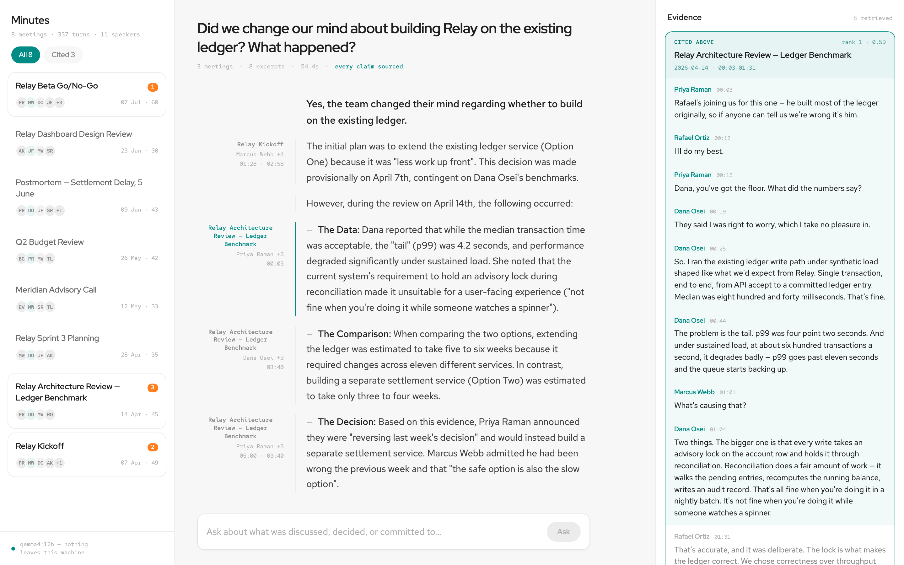
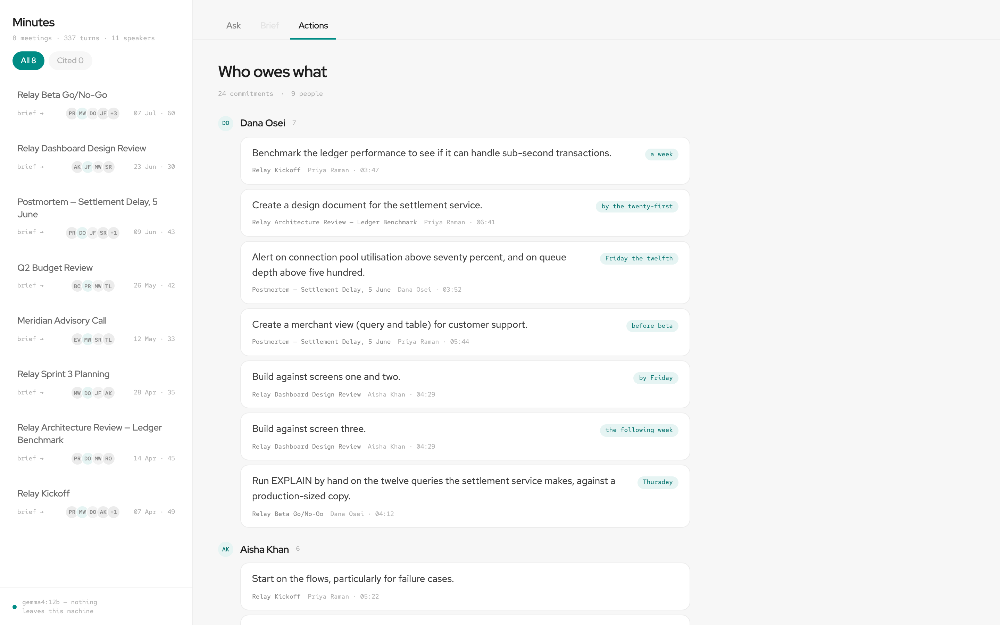
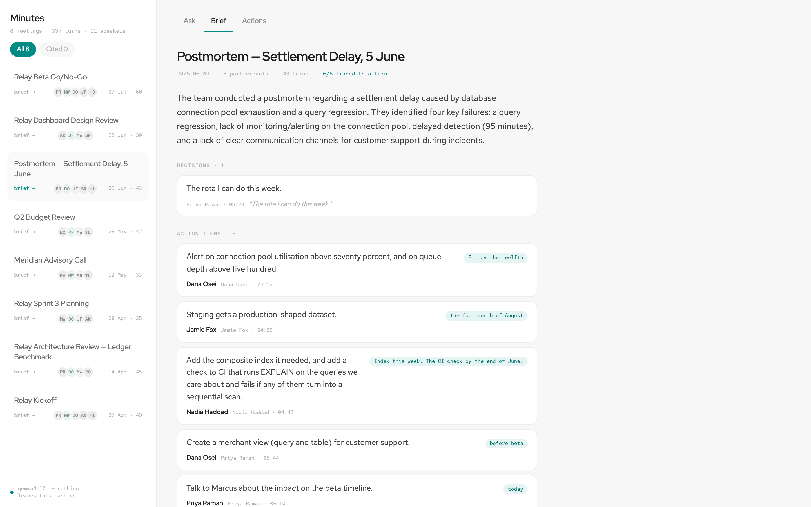
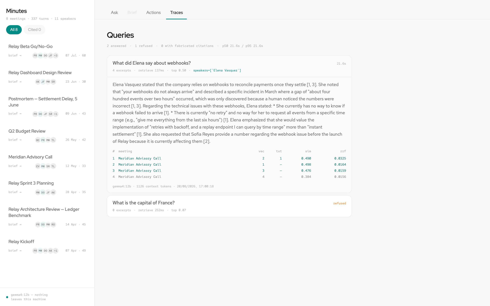
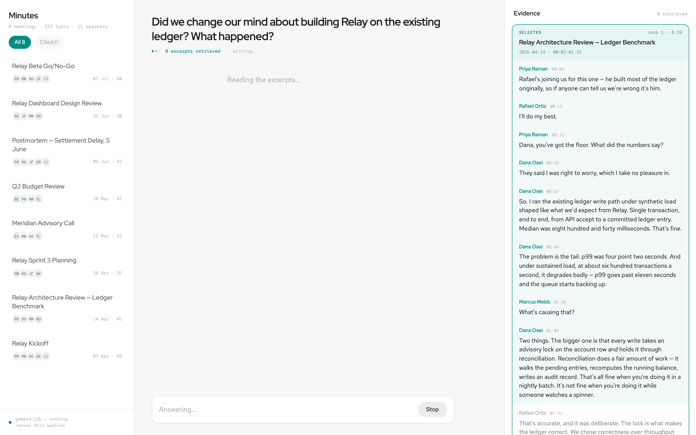
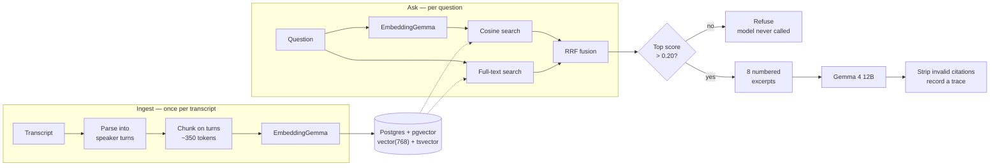
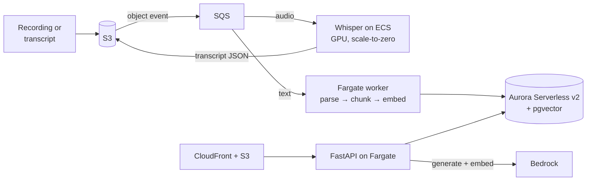

# Meeting Intelligence System

Ask questions across a set of meeting transcripts and get answers where every
claim names the meeting, the speaker and the timestamp it came from. Built for
the NewPage technical assessment (Option 3). Runs entirely on your machine.



## What it does

**Ask** — answers with the source in the margin beside each claim; click one and
the transcript opens at that moment. The evidence panel shows everything the
retriever returned, not just what got cited — seeing what the model chose *not*
to use is most of what auditing means.

**Brief** — per meeting: summary, decisions, who committed to what. Not RAG;
extracted once and read from Postgres.

**Actions** — every commitment across every meeting, grouped by owner, linked
back to the turn where it was made.

**Traces** — every query with the retrieval behind it.

<details>
<summary>More screenshots</summary>

| | |
|---|---|
|  |  |
| Action board | Per-meeting brief |
|  |  |
| Query traces | Evidence lands before the first token |

</details>

## Setup

Docker, Python 3.12+, Node 22+, and [Ollama](https://ollama.com).

```bash
ollama pull gemma4:12b            # 7.6GB — the generator
ollama pull embeddinggemma:300m   # 622MB — embeddings

make install    # venv, npm install, .env
make up         # Postgres + pgvector in Docker
make seed       # migrate and ingest the 8-meeting corpus (~5s)

make api        # terminal 1
make web        # terminal 2 → http://localhost:5173
```

`make health` checks the database, Ollama and both models are reachable.
`make check` runs lint and 197 tests. `make eval` runs the golden set (~8 min).

Only Postgres is containerised — Docker on macOS can't reach Metal, so a
containerised model falls back to CPU. The API image is still built in CI, since
it's the artefact that would deploy to Fargate.

## How it works



Two models, two jobs. **EmbeddingGemma** turns text into 768 numbers and never
writes a word; **Gemma 4** reads the excerpts and never sees a vector. The
matching between them is plain arithmetic in Postgres.

Nothing about your meetings is in Gemma 4's weights — it's handed numbered
excerpts and asked what they say, which is what makes citations checkable and
refusals possible.

## The decisions that mattered

**Chunking on speaker turns, not token windows.** A fixed window cuts through an
exchange — a question in one chunk, its answer in the next, neither retrieving
usefully. Chunks grow by whole turns to ~350 tokens with one turn of overlap,
because pronouns don't respect boundaries. Each carries a header (meeting, date,
speakers, time range) into the embedding, so the vector knows *when* and *who*.

**Hybrid retrieval, fused with RRF.** Meetings are thick with proper nouns and
embeddings are bad at those — `PAY-1042` embeds near every other ticket ID.
Keyword search nails them and is hopeless at paraphrase. Fusing by *rank* avoids
inventing a weight between two uncalibrated scales.

**Local models are a product decision** — transcripts are among the most
sensitive text an organisation holds, so running locally makes privacy
architectural rather than contractual.

Full reasoning: [`docs/PLAN.md`](docs/PLAN.md), written before any code.
Numbers: [`docs/MEASUREMENTS.md`](docs/MEASUREMENTS.md).

## Guardrails, and the measurement that rewrote the plan

The plan said: *refuse below a similarity threshold, without calling the LLM.*
Measured, that doesn't survive.

| answerable | sim | unanswerable | sim |
|---|---|---|---|
| What caused the settlement delay? | 0.561 | What happened in the August board meeting? | **0.386** |
| When did we decide to move GA? | **0.295** | What is the capital of France? | 0.069 |

**The ranges overlap.** The worst answerable question scores below the best
unanswerable one — "August board meeting" *is* semantically adjacent to real
content, it just isn't answerable. Any threshold strict enough to catch it also
rejects a legitimate question. So the floor sits at 0.20 and does only what it
reliably can: reject questions unrelated to the corpus without paying for a
generation. Refusing near-misses is the generator's job, and that's measured.

The rest is enforced in code, not requested in a prompt. Citations outside the
supplied range are stripped. Every extracted decision carries a verbatim quote
matched back to a real turn — **39 of 41 (95.1%)**, and one miss reads
*"provisionly"* where the transcript says *"provisionally"*: the model rebuilt
the quote from memory rather than copying it, and the matcher caught it.
Transcripts are fenced as data, never instructions.

## What's measured

24 hand-written cases against the real model and corpus — deliberately not
LLM-as-judge, since a 12B grading a 12B mostly measures shared blind spots.

| retrieval | **93%** | expected meetings retrieved |
|---|---|---|
| grounded | **100%** | answers cited excerpts that exist |
| refusal | **90%** | declined when there was nothing to answer from |
| latency | **p50 21.4s, p95 34.1s** | generation only |

Two failures, neither tuned away. One was the eval being wrong — an inline
injection marked must-refuse, when answering the legitimate half and ignoring
the instruction is correct, and is what happened. One is real: *"How did the
pricing model change and why?"* misses the meeting where the customer rejected
it, because she used her own words (*"a number my CFO will simply refuse"*) and
the question uses the abstraction. Both retrievers miss it identically — the
honest limit of hybrid search is that it can't fix a vocabulary mismatch.

## Productionising on AWS



**Postgres → Aurora Serverless v2 with pgvector.** Same schema, same queries, no
code change — the payoff for choosing pgvector over a separate vector store.

**Ollama → Bedrock.** Both models move behind one managed endpoint, with no GPU
to run or size. The provider abstraction anticipates this: `llm/base.py` is a
Protocol with local, cloud and fake implementations, so a Bedrock adapter is a
new file rather than a refactor. Two caveats: transcripts then leave your account
boundary, which may be exactly what the privacy argument forbids — open weights
on SageMaker keeps the residency story at the cost of an always-warm GPU. And
**changing the embedding model means re-embedding everything**, since vectors
from different models aren't comparable and mixing them degrades retrieval
quietly rather than loudly.

**Ingestion becomes real-time.** Upload lands in S3, the object event fans out
through SQS, and a Fargate worker runs the same `ingest_transcript` the CLI
calls today — the seam already exists. The meeting row carries a status the UI
polls, so a transcript shows as *processing* and becomes searchable when its
chunks commit. SQS brings retries and a dead-letter queue, so a poison
transcript parks itself rather than blocking the queue.

**Audio via Whisper on ECS.** Most organisations have recordings, not tidy
transcripts. Whisper `large-v3` on GPU-backed ECS tasks, triggered by the same
S3 event, produces word-level timestamps and diarisation and writes JSON back to
S3. That becomes a fourth parser alongside the three that exist; everything
downstream is unchanged, because
[`parser.py`](api/src/meetingiq/ingest/parser.py) already normalises formats into
one contract of `(speaker, start, end, text)`. Transcription is bursty and slow,
so it belongs on a scale-to-zero service, not the request path.

**What genuinely has to be built.** Auth and multi-tenancy: RLS in Postgres, a
tenant claim in the JWT, tenant-scoped embeddings so one customer's corpus can
never surface in another's retrieval. RDS Proxy, before Fargate tasks exhaust
connections. And HNSW's `m` / `ef_construction` want measuring once the corpus
is millions of chunks rather than 35.

## Deliberately not built

No auth or multi-tenancy — the biggest gap, called out rather than hidden. No
upload endpoint, rate limiting, caching or pagination. No React component tests;
the 21 web tests cover citation parsing and source mapping, where the
correctness lives. Transcripts over the context budget are *refused*, not
truncated — a brief that silently omits the end of a meeting while looking
complete is worse than an error.

## How I used AI tools

Built with Claude Code, which wrote most of the lines while I made most of the
decisions. Committing the plan before any code gave me something to argue with
when a measurement contradicted it, which happened twice.

What I had to catch: a guardrail that implemented the plan faithfully and would
have silently rejected real questions; margin provenance that printed "Marcus
Webb +4" beside a claim Marcus never made; an extraction schema with `due`
optional, so the model declined to populate it 24 times out of 24 with nothing
appearing wrong. My rules: never merge a diff I can't explain, and run the
thing — most of the real bugs here were invisible in review, obvious on sight.

## Next

**Resumable sessions.** Questions are standalone today. A `sessions` table and a
`session_id` on `query_traces` would make a trace a conversation turn, but the
real work is retrieval: *"why did they change it?"* embeds to nothing useful, so
a follow-up needs rewriting into a standalone question before it hits the floor.

**Grouping the action board by meeting** as well as by owner — both groupings in
one response, so the toggle costs no refetch.

Then: a **reranker**, for the vocabulary mismatch hybrid search can't fix.
**Entailment checking**, to close the gap between "cited" and "grounded".
**Auth and multi-tenancy**, before this touches a real transcript.
**Utterance-level citations** — answers cite a chunk spanning a median of 12
turns. A **larger adversarial corpus**: eight meetings demonstrate the
mechanisms and are too few to stress them.
